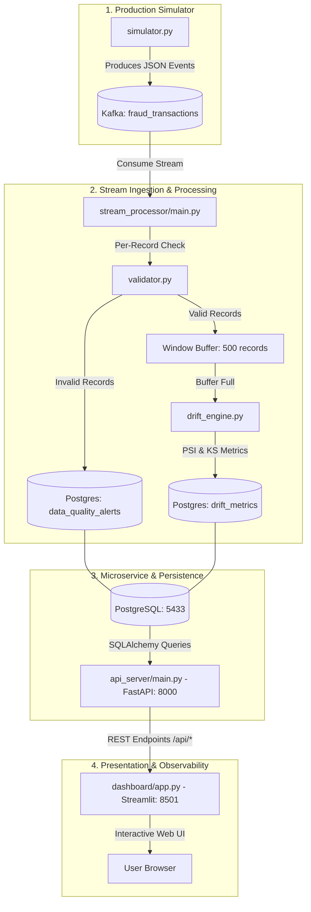

# 🛡️ DriftGuard: Real-Time ML Data Quality & Drift Monitoring Platform
## Complete Technical Reference & Beginner-to-Advanced System Guide

---

## 📖 Table of Contents
1. [Executive Summary & The Core Problem](#1-executive-summary--the-core-problem)
2. [The "Why": Why Traditional Monitoring Fails ML](#2-the-why-why-traditional-monitoring-fails-ml)
3. [The "What": What DriftGuard Does](#3-the-what-what-driftguard-does)
4. [Core Concepts & Mathematical Foundations](#4-core-concepts--mathematical-foundations)
   - [Data Quality vs. Data Drift vs. Concept Drift](#data-quality-vs-data-drift-vs-concept-drift)
   - [Kolmogorov-Smirnov (KS) Test (Continuous Features)](#kolmogorov-smirnov-ks-test-continuous-features)
   - [Population Stability Index (PSI) (Categorical Features)](#population-stability-index-psi-categorical-features)
   - [Schema & Boundary Validation](#schema--boundary-validation)
5. [The "How": System Architecture & Data Flow](#5-the-how-system-architecture--data-flow)
6. [Repository & Codebase Breakdown](#6-repository--codebase-breakdown)
7. [Step-by-Step Execution Guide](#7-step-by-step-execution-guide)
8. [Understanding the Live Simulation](#8-understanding-the-live-simulation)
9. [Interview & Resume Playbook](#9-interview--resume-playbook)
10. [Future Enhancements & Production Roadmap](#10-future-enhancements--production-roadmap)
11. [Transitioning from Synthetic Simulation to Live Production Traffic](#11-transitioning-from-synthetic-simulation-to-live-production-traffic)

---

## 1. Executive Summary & The Core Problem

In standard software engineering, systems usually fail with loud signals: HTTP `500 Internal Server Error`, exceptions, crash dumps, or memory leaks.

**Machine Learning systems fail silently.** 

When an ML model is deployed to production, it will happily accept inputs and compute predictions even if:
- Upstream data formats changed (e.g. currency shifted from USD to EUR, or null values were converted to `0`).
- Real-world user behavior shifted (e.g. purchasing habits changed during holiday season, or fraud syndicates adopted new strategies).
- Feature distributions drifted far away from the training dataset.

In all these cases, the model returns an HTTP `200 OK` response with a valid float prediction, but the business logic is silently producing catastrophic errors.

**DriftGuard** is a distributed, real-time observability platform designed to catch both **data quality corruptions** and **statistical distribution drift** in real-time as transactions stream through an event-driven pipeline.

---

## 2. The "Why": Why Traditional Monitoring Fails ML

| Metric Category | Traditional APM (Datadog / New Relic) | ML Observability (DriftGuard) |
| :--- | :--- | :--- |
| **System Health** | CPU, RAM, Latency (p95, p99), Error Rates | Model inference latency, consumer lag |
| **Data Integrity** | HTTP payload parsing, JSON schema | Boundary validation, type consistency, null rates |
| **Statistical Validity** | *None (opaque to distribution shifts)* | **KS-Test, PSI, KL-Divergence, Quantile Shifts** |
| **Failure Mode** | Crashes, timeouts, HTTP 5xx | **Silent degradation (model makes inaccurate predictions with 200 OK)** |

---

## 3. The "What": What DriftGuard Does

DriftGuard acts as an automated statistical watchtower for a live Credit Card Fraud Detection model:

1. **High-Throughput Ingestion**: Consumes live transaction events via **Apache Kafka**.
2. **Deterministic Data Quality Validation**: Validates every single record for schema violations, missing values, and physical boundary violations (e.g., negative income, impossible age).
3. **Rolling-Window Statistical Drift Engine**: Accumulates valid events into tumbling/sliding windows and runs statistical hypothesis testing against the frozen baseline distribution.
4. **Persistent Auditing & Metrics Storage**: Logs every schema alert and drift calculation into a **PostgreSQL** database via **SQLAlchemy**.
5. **Decoupled API Gateway**: Exposes real-time health metrics, feature drift scores, and alert streams through a **FastAPI** REST interface.
6. **Live Observability UI**: Renders an interactive, auto-refreshing monitoring dashboard in **Streamlit**.
7. **Production Failure Simulator**: Generates synthetic workloads simulating healthy states, corrupted data pipelines, and evolving macroeconomic fraud drift.

---

## 4. Core Concepts & Mathematical Foundations

### Data Quality vs. Data Drift vs. Concept Drift

```
                                  ┌───────────────────────────┐
                                  │   Incoming Raw Stream     │
                                  └─────────────┬─────────────┘
                                                │
                     ┌──────────────────────────┴──────────────────────────┐
                     ▼                                                     ▼
        ┌─────────────────────────┐                           ┌─────────────────────────┐
        │  Data Quality Failures  │                           │    Distribution Drift   │
        └────────────┬────────────┘                           └────────────┬────────────┘
                     │                                                     │
        ┌────────────┴────────────┐                           ┌────────────┴────────────┐
        │ • Null / Missing values │                           │ • Covariate/Feature Drift│
        │ • Type mismatch (str)   │                           │   P(X) changes          │
        │ • Out of bounds (< 18)  │                           │ • Concept Drift         │
        │ • Unseen enum category  │                           │   P(Y|X) changes        │
        └─────────────────────────┘                           └─────────────────────────┘
```

- **Data Quality Violation**: A record is malformed or invalid on its own (e.g., `user_age = -10`).
- **Feature Drift (Covariate Shift)**: The input distribution $P(X)$ changes over time, while the relationship $P(Y|X)$ might remain the same. (e.g., average transaction amount doubles).
- **Concept Drift**: The actual ground truth definition of the target $Y$ given features $X$ changes. (e.g., transactions that used to be legitimate are now fraudulent).

---

### Kolmogorov-Smirnov (KS) Test (Continuous Features)

For numerical features (`user_age`, `user_income`, `transaction_amount`, `distance_from_home`, `time_since_last_txn`), we use the two-sample **Kolmogorov-Smirnov (KS) Test**.

#### 1. Intuition
The KS test compares the **Empirical Cumulative Distribution Function (ECDF)** of the baseline training data $F_{\text{base}}(x)$ against the ECDF of the incoming production window $F_{\text{prod}}(x)$.

```
   ECDF (Probability)
   1.0 ┤                     /─── Production ECDF
       │                   / |
       │                 /   |  <--- Max Distance D
       │               /     |
       │             /───────/─── Baseline ECDF
       │           /
   0.0 └─────────/─────────────────────────────> Feature Value (x)
```

#### 2. The Test Statistic ($D$)
The test statistic $D$ is the maximum vertical distance between the two CDF curves:
$$D = \sup_{x} |F_{\text{base}}(x) - F_{\text{prod}}(x)|$$

#### 3. Decision Rule
- The test returns a test statistic $D \in [0, 1]$ and a $p$-value.
- **Null Hypothesis ($H_0$)**: The two samples are drawn from the exact same underlying distribution.
- **Threshold**: If $p\text{-value} < 0.05$, we reject $H_0$, meaning there is a statistically significant distribution shift.
- **Severity Levels**:
  - $p \ge 0.05 \implies$ **Healthy** (No Drift)
  - $p < 0.05 \text{ and } D < 0.15 \implies$ **Warning** (Moderate Drift)
  - $p < 0.05 \text{ and } D \ge 0.15 \implies$ **Critical** (Severe Drift)

---

### Population Stability Index (PSI) (Categorical Features)

For categorical features (`merchant_category`), we use the **Population Stability Index (PSI)**.

#### 1. Intuition
PSI measures how much a variable has shifted across discrete bins or categories between a reference dataset (Actual/Production) and a baseline dataset (Expected/Training).

#### 2. The Formula
$$\text{PSI} = \sum_{i=1}^{k} \Big( P_{\text{actual}}(i) - P_{\text{expected}}(i) \Big) \times \ln\left(\frac{P_{\text{actual}}(i)}{P_{\text{expected}}(i)}\right)$$

Where:
- $k$ is the number of categories/bins.
- $P_{\text{actual}}(i)$ is the percentage of observations in category $i$ in the current production window.
- $P_{\text{expected}}(i)$ is the percentage of observations in category $i$ in the baseline dataset.
- A small epsilon ($10^{-4}$) is added to prevent division by zero or $\ln(0)$.

#### 3. Standard Industry Thresholds
- **$\text{PSI} < 0.10$**: **Healthy** — No significant change. The model can be trusted.
- **$0.10 \le \text{PSI} < 0.25$**: **Warning** — Moderate shift. Requires monitoring.
- **$\text{PSI} \ge 0.25$**: **Critical** — Major distribution shift. Triggers model retraining or fallback policies.

---

### Schema & Boundary Validation

Before any statistical analysis, every record passes through deterministic schema checks:

```python
# Defined in validator.py
RULES = {
    'user_age': {'type': int, 'min': 18, 'max': 90},
    'user_income': {'type': (int, float), 'min': 0, 'max': 1_000_000},
    'transaction_amount': {'type': (int, float), 'min': 0.01, 'max': 100_000},
    'merchant_category': {'type': int, 'allowed': [0, 1, 2, 3, 4]},
    'distance_from_home': {'type': (int, float), 'min': 0},
    'time_since_last_txn': {'type': (int, float), 'min': 0}
}
```
If a record violates any rule:
1. It is flagged as an invalid record.
2. A detailed alert (`SCHEMA_OR_BOUND`) is recorded to PostgreSQL.
3. The invalid record is **excluded** from the drift calculation buffer so corrupted numbers do not distort the statistical test.

---

## 5. The "How": System Architecture & Data Flow



---

## 6. Repository & Codebase Breakdown

```
project_2/
│
├── .vscode/
│   └── settings.json               # Configures Python interpreter path
│
├── data/
│   ├── generate_dataset.py         # Generates 100,000 synthetic transaction records
│   ├── train_model.py              # Trains XGBoost model & extracts baseline statistics
│   ├── baseline_dataset.csv        # Baseline training data CSV
│   ├── baseline_stats.json         # Statistical reference fingerprint
│   └── fraud_model.joblib          # Serialized XGBoost classification model
│
├── stream_processor/
│   ├── validator.py                # DataValidator class (deterministic rules)
│   ├── drift_engine.py             # DriftEngine class (KS-Test and PSI algorithms)
│   ├── models.py                   # SQLAlchemy ORM models & database initialization
│   └── main.py                     # Kafka consumer loop connecting validator, engine & DB
│
├── api_server/
│   └── main.py                     # FastAPI server exposing REST endpoints
│
├── dashboard/
│   └── app.py                      # Streamlit dashboard visualizing metrics and alerts
│
├── simulator/
│   └── simulator.py                # Production traffic generator with dynamic failure modes
│
├── docker-compose.yml              # Container orchestration (Kafka, Zookeeper, Postgres, Grafana)
└── prometheus.yml                  # Prometheus metric scraping configuration
```

---

## 7. Step-by-Step Execution Guide

### Prerequisites
1. **Docker Desktop** installed and running.
2. **Python 3.13 / 3.12** installed.

---

### Step 1: Start Background Infrastructure
In the project root folder:
```powershell
docker compose up -d
```

### Step 2: Generate Baseline & Train Model
```powershell
python data/generate_dataset.py
python data/train_model.py
```

### Step 3: Initialize Database Schema
```powershell
python stream_processor/models.py
```

### Step 4: Run the Microservices

Open separate terminal tabs or run in background:

**Terminal 1: Stream Processing Worker**
```powershell
python stream_processor/main.py
```

**Terminal 2: FastAPI Server**
```powershell
python api_server/main.py
```

**Terminal 3: Streamlit UI Dashboard**
```powershell
python -m streamlit run dashboard/app.py --server.headless true
```

**Terminal 4: Production Traffic Simulator**
```powershell
python simulator/simulator.py
```

---

### Step 5: View the Web Dashboard
Open your browser and navigate to:
🌐 **[http://localhost:8501](http://localhost:8501)**

---

## 8. Understanding the Live Simulation

When the simulator is running, it cycles through specific phases to demonstrate the platform's detection capabilities:

```
Timeline (Events Sent)
0 ──────────── 1000 ───────── 1050 ──────────── 2000 ───────────── 3500 ──────────>
    [Healthy]          [Bad Data]      [Healthy]          [Drift Mode]     [Healthy]
  Quality: 100%      Quality Alerts   Quality: 100%      Age & Amount      All Green
  Drift: None        Recorded to DB   Drift: None        Critical Drift
```

1. **Events 0 – 1000 (Healthy)**:
   - Data matches baseline distribution.
   - Dashboard shows `Data Quality: 100%`, all features display `Status: Healthy` (green).
2. **Events 1000 – 1050 (Data Quality Corruption)**:
   - Injects bound violations (e.g. `user_age < 18`) and invalid types.
   - Stream processor catches and logs them to the `data_quality_alerts` table.
   - Dashboard displays them in the **Recent Data Quality Alerts** table.
3. **Events 2000 – 3500 (Statistical Distribution Drift)**:
   - Injects older users ($N(55, 10)$ instead of $N(35, 12)$) and higher transaction amounts.
   - Stream processor collects a 500-item window, computes KS-Test ($D > 0.15, p < 0.05$).
   - Dashboard flags `user_age` as **Critical (red)** with high drift score.

---

## 9. Interview & Resume Playbook

### Resume Bullet Points

#### For SDE / Backend Engineering Roles:
> - *Architected an event-driven ML observability platform using **Apache Kafka**, **PostgreSQL**, and **FastAPI** to process and validate streaming transaction data at 100+ events/sec.*
> - *Implemented decoupled microservices orchestrated via **Docker Compose**, persisting schema violation alerts and statistical metrics with **SQLAlchemy ORM**.*
> - *Built a low-latency REST API gateway in **FastAPI** to asynchronously serve real-time system metrics to external monitoring dashboards.*

#### For Data Engineering / MLOps Roles:
> - *Developed a real-time data quality and drift monitoring engine utilizing **Kolmogorov-Smirnov (KS) tests** and **Population Stability Index (PSI)** over rolling sliding windows.*
> - *Created an automated schema and boundary validator that intercepts malformed records and logs structured data quality alerts to PostgreSQL before downstream inference.*
> - *Designed an interactive **Streamlit** dashboard displaying feature-level drift severity, data freshness, and real-time schema violation streams.*

---

### Top Technical Interview Questions & Answers

#### Q1: "Why use Apache Kafka instead of sending events directly via HTTP POST to FastAPI?"
> **Answer**: *"Using Kafka provides decoupled, fault-tolerant ingestion. If the stream processor or database slows down under heavy load, Kafka acts as a distributed buffer, absorbing traffic spikes without dropping requests or blocking production clients. It also allows multiple independent consumers (e.g. fraud inference, drift monitoring, fraud analytics) to read the same event stream without tight coupling."*

#### Q2: "How did you choose between the KS-Test and PSI for drift detection?"
> **Answer**: *"The Kolmogorov-Smirnov (KS) test is a non-parametric test ideal for continuous numerical variables (like transaction amounts or age) because it operates on the empirical cumulative distribution function without requiring manual binning. Population Stability Index (PSI), on the other hand, is specifically designed for discrete categorical distributions (like merchant categories) or binned variables, measuring percentage shifts across predefined buckets."*

#### Q3: "What is the trade-off with the rolling window size (500 events)?"
> **Answer**: *"Window size represents a trade-off between statistical confidence and alert latency. A smaller window (e.g., 50 events) detects drift faster but suffers from high variance and false positive alerts. A larger window (e.g., 5,000 events) provides high statistical confidence but delays detection. A 500-item window provides a strong balance, giving sufficient sample size for the KS-test while triggering alerts within seconds under production throughput."*

#### Q4: "What automated actions should trigger when Critical Drift is detected in production?"
> **Answer**: 
> 1. *Trigger an automated alert via PagerDuty/Slack to the on-call ML Engineer.*
> 2. *Trigger an automated pipeline (e.g. Airflow DAG) to fetch new ground-truth labels and retrain the XGBoost model on recent data.*
> 3. *Optionally route traffic to a conservative fallback rule-based system or an ensemble model until retrained models pass validation benchmarks.*

---

## 10. Future Enhancements & Production Roadmap

1. **Prometheus & Grafana Integration**: Export custom metrics from the stream processor directly into Prometheus via a Prometheus metrics exporter, visualizing them on dedicated Grafana panels.
2. **Concept Drift & Delayed Feedback Loop**: Pair production predictions with delayed ground truth fraud labels (chargebacks) to monitor ROC-AUC degradation over time.
3. **Multi-Model Support**: Scale the stream processor to monitor multiple models simultaneously using Kafka topic headers or schema registries.
4. **Automated CI/CD Retraining Webhooks**: When PSI exceeds $0.25$ for consecutive windows, trigger a GitHub Actions workflow or Airflow DAG to trigger model retraining.

---

## 11. Transitioning from Synthetic Simulation to Live Production Traffic

While DriftGuard currently includes a synthetic traffic generator (`simulator.py`) for reproducible benchmarking and local demonstration, the underlying Kafka stream processor is **100% production-ready** to connect to live real-world data pipelines.

Here is how real-time enterprise architectures connect to DriftGuard:

### 1. Payment Gateway Webhooks & Event Hooks (Direct Ingestion)
```
[User Checkout] ➔ [Stripe / Adyen API] ➔ [Payment Webhook Handler] ➔ [Kafka: fraud_transactions]
```
- In production, payment gateways (Stripe, PayPal, Adyen, Square) emit asynchronous webhooks on transaction attempts.
- A lightweight ingestion gateway parses the incoming JSON webhook payload and publishes the event directly to the Kafka `fraud_transactions` topic.

### 2. Change Data Capture (CDC) with Debezium
```
[Production DB: transactions table] ➔ [Debezium PostgreSQL Connector] ➔ [Kafka: fraud_transactions]
```
- For enterprise transactional systems where orders write to an OLTP database (e.g. PostgreSQL or MySQL), a **Debezium CDC connector** tails the database Write-Ahead Log (WAL).
- Every new row insert is automatically streamed into Kafka in sub-milliseconds without adding latency to the primary database.

### 3. Replaying Real-World Public Benchmark Datasets
To evaluate the platform against real historical fraud distributions instead of purely synthetic data:
- Stream real-world anonymized credit card fraud datasets (e.g., the **Kaggle IEEE-CIS Fraud Detection Dataset** or **European Cardholders Dataset**).
- A dataset replay worker reads records from historical CSV/Parquet files and pushes them to Kafka respecting original inter-arrival timestamps.

### 4. Delayed Ground-Truth Matching (Chargeback Ingestion)
- **The Reality of Fraud**: Fraud labels ($Y$) are delayed by 30 to 90 days due to bank chargebacks.
- **How to Handle in Production**:
  - Live features ($X$) are monitored in real-time via **KS-Test** and **PSI** (Data Drift).
  - When dispute reports arrive weeks later, a separate stream consumer matches chargeback flags by `transaction_id` in PostgreSQL to calculate true **Precision, Recall, and ROC-AUC degradation** over time (Concept Drift).

---

*DriftGuard Architecture & Technical Documentation — Designed for Production ML Systems.*
